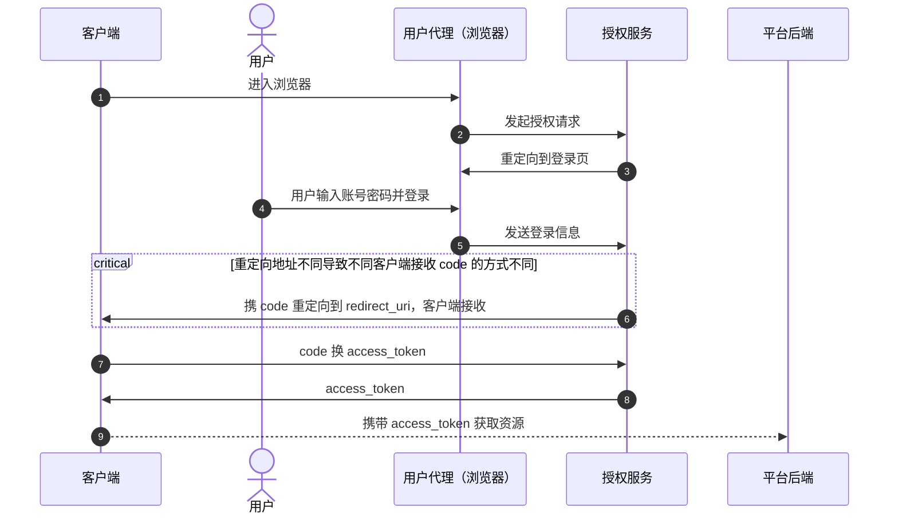

> 借鉴了[这里](https://www.digitalocean.com/community/tutorials/an-introduction-to-oauth-2)

## 技术规范

OAuth2 的技术规范和本文用到的相关术语定义可参考 [RFC 6749](https://datatracker.ietf.org/doc/html/rfc6749)，以及针对原生应用的 [RFC 8252](https://datatracker.ietf.org/doc/html/rfc8252)


## 通用授权时序图

业界普遍使用 `Authorization Code` 授权类型（Grant Type）。不同客户端的登录流程大致是一致的：



可同时参考 [RFC 6749](https://datatracker.ietf.org/doc/html/rfc6749#section-4.1) 的流程图

> 有些应用在发送登录信息后，还会进入授权页，让用户确认具体需要授权哪些 scope。而我们现在和之后应该也不会有其他 scope，且这本身就是我们自己的授权服务，没有必要设置这个门槛

## 客户端授权流程差异

 `Authorization Code` 授权类型要求必须通过浏览器进行授权。对于管理平台，其本身就是页面，使用浏览器使用重定向即可实现以上流程。而对于非页面项目，就需要在登录时打开浏览器，并等待回调。切换应用导致了客户端授权流程的差异，即上图中标为 `critical` 的部分。

### 授权流程差异

 授权流程基本和通用授权时序图一致，`客户端` 和 `用户代理` 其实都是浏览器，只是在不同的地址

### 环回地址重定向回调流程

一般授权服务会支持环回地址重定向。使用环回地址回调，客户端需要提供环回回调地址，比如 *127.0.0.1:65543/auth/callbackb*。对应地服务端需要指定回调地址为 *127.0.0.1/auth/callback*

> 如果你在开发 Jetbrains IDE 插件，可以使用其内置的服务器（一般是 65543 端口）

授权回调部分流程是：

 ```mermaid
 sequenceDiagram
    autonumber
    participant c as Jetbrains 插件
    participant ua as 用户代理（浏览器）
    participant a as 授权服务

    a ->> c: 访问环回回调地址
    c ->> a: 返回 302 响应重定向到指定页
    a ->> ua: 重定向到登录成功/失败页

 ```

环回回调地址类似于：GET 127.0.0.1:65543/auth/callback?code=...&state=...

环回地址重定向是 [RFC 8252](https://datatracker.ietf.org/doc/html/rfc8252#section-7.3) 推荐的一种桌面应用接收 OAuth 回调的方式

使用环回地址的好处是，授权服务可以了解和记录到实际的登录结果

### 中间页重定向回调流程

有些程序会在系统中注册自定义协议。以 VSCode 为例，使用浏览器访问 `vscode://...` ，浏览器会弹框提示打开对应的应用。利用这一技术可以实现更流畅的 OAuth2 桌面应用的登录

但是直接使用会带来一个问题。虽然使用自定义协议打开客户端可以接收到授权码并进行后续流程，但因为应用切换，授权服务发送的回调 http 请求将无法接收到响应，导致浏览器一直停留在登录页。为避免此问题，我们使用了`中间页`方案，即回调时先跳转到中间页，再由中间页访问自定义协议打开客户端

因此，中间页重定向回调流程是：

 ```mermaid
 sequenceDiagram
    autonumber
    participant c as 客户端
    participant ua as 用户代理（浏览器）
    participant a as 授权服务

    a ->> ua: 重定向到中间页
    ua ->> c: 访问自定义协议打开客户端

 ```

自定义协议也是 [RFC 8252](https://datatracker.ietf.org/doc/html/rfc8252#section-7.1) 推荐的一种桌面应用接收 OAuth 回调的方式

## PKCE

虽然各个客户端被注册成使用 BASIC 认证，但实际上管理平台、插件等都属于公开客户端。在进行获取 access_token 时，全程都在用户可感知的客户端进行，所以用户或黑客程序有能力轻松地获取到 Header 中的客户端 id 和密钥信息。所以，为了保证授权流程的安全，以上客户端必须使用 PKCE 技术

PKCE（Proof Key of Code Exchange）工作流程如下：

1. 生成 PKCE 相关参数
    - 生成一个高熵的随机字符串作为 `code_verifier`
    - 选择一个 hash 算法，一般是 SHA-256
    - 通过 `urlEncode(hash(code_verifier))` 获取 `code_challenge`
2. 发起请求授权时携带 `code_challenge` 和 `code_challenge_method`。如果 hash 算法是 SHA-256，则 `code_challenge_method` 是 `S256`
3. 在使用 code 换取 access_token 时携带 `code_verifier`。授权服务此将结合两步接收的 PKCE 相关参数进行校验

## Token 保存和更新

Web 客户端可以使用加密的 HTTP Cookie（iron-session）保存 token。桌面客户端可以使用系统`钥匙串`保存 token。

更新 token 需要用到 `Refresh Token` 授权类型，携带 *code 换 access_token* 时返回的 `refresh_token` 访问获取 token 接口即可

## State

state 参数是防止 CSRF 攻击 的重要机制：客户端生成随机 state 并保存，发起授权时携带此参数，回调时客户端需验证 state 是否匹配

## 获取授权相关配置

授权流程涉及到多个 url 的调用，可能还需知道授权服务支持的授权类型，PKCE 支持的 hash 算法等。而实际我们只需知道基础路径，相关内容都可通过 `$baseUrl/.well-known/openid-configuration` 接口获取到

