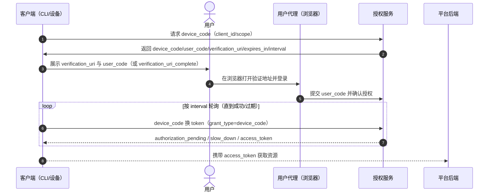

## 技术规范

OAuth2 的技术规范和本文用到的相关术语定义可参考 [RFC 8628](https://datatracker.ietf.org/doc/html/rfc8628)

## 通用授权时序图

对于无法直接调用浏览器的程序，比如命令行，通常使用 `Device Code` 授权类型（Grant Type）。

可同时参考 [RFC 8628](https://datatracker.ietf.org/doc/html/rfc8628#section-3) 的流程说明。

## 关键参数和步骤

1. 客户端调用 device authorization endpoint，获取：
   - `device_code`：设备端轮询 token 接口时使用
   - `user_code`：用户在浏览器输入的短码
   - `verification_uri`：用户需要访问的验证地址
   - `verification_uri_complete`：可直接完成验证的地址（如服务端提供）
   - `expires_in`：`device_code` 过期时间（秒）
   - `interval`：建议轮询间隔（秒）
2. 用户在浏览器完成登录与授权确认
3. 客户端按 `interval` 轮询 token endpoint，直到拿到 `access_token` 或超时

## 轮询错误码处理建议

- `authorization_pending`：用户尚未完成授权，继续按间隔轮询
- `slow_down`：客户端轮询过快，增加轮询间隔后重试
- `expired_token`：`device_code` 已过期，需重新发起设备授权流程
- `access_denied`：用户拒绝授权，结束流程并提示用户重试或退出

## 安全与体验建议

- 不要在日志中记录完整的 `device_code`、`access_token`、`refresh_token`
- `user_code` 展示给用户时，建议分组显示（如 `WDJB-MJHT`）并给出过期倒计时
- 若服务端返回 `verification_uri_complete`，优先展示，减少用户手动输入成本
- 对于 CLI，可在轮询期间提供进度提示，并支持用户主动取消登录

## Token 保存和更新

`Device Code` 获取 token 后的保存与刷新策略，与 `Authorization Code` 基本一致：可参考 [OAuth2 Authorization Code 授权工作流](/2026/03/18/OAuth2AuthCodeWorkflow/) 中的 `Token 保存和更新` 章节。

## 获取授权相关配置

如果服务支持 OIDC Discovery，可通过 `$baseUrl/.well-known/openid-configuration` 获取端点元数据（如 device authorization endpoint、token endpoint 等）；也可参考 OAuth 2.0 Authorization Server Metadata（RFC 8414）约定。更通用的配置获取建议可参考 [OAuth2 Authorization Code 授权工作流](/2026/03/18/OAuth2AuthCodeWorkflow/) 中的 `获取授权相关配置` 章节。